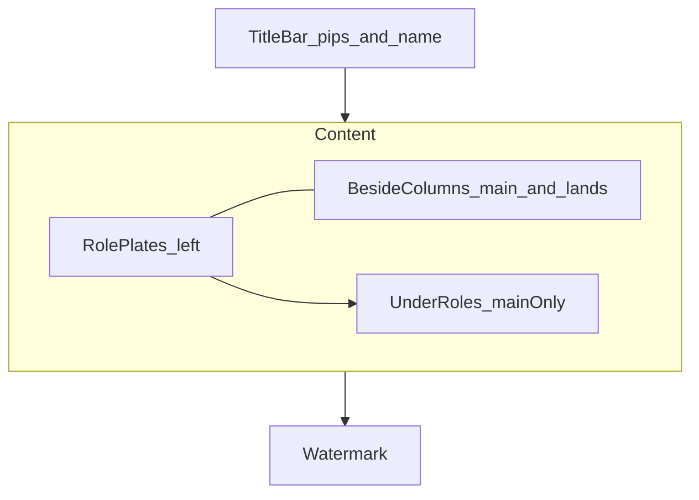
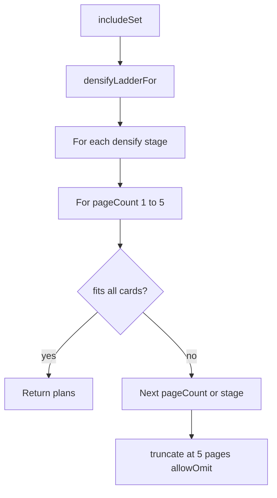

# Glance layout strategies

Reference for how Hub “at a glance” PNGs place cards. Layout lives in `@rayenz-hub/shared`; the API enriches art and composites with sharp. This doc covers **placement only** — see [`packages/api/README.md`](../packages/api/README.md) for art resolution and packaging.

| Product | Entry point | Planner |
|---------|-------------|---------|
| Deck glance | `buildGlanceLayoutPlan(includeSet, deckName)` | Single 1920×1080 page; shrink card size until fit |
| Swap glance | `buildSwapGlanceLayoutPlans(includeSet)` | 1–5 pages at fixed M; densify ladder then truncate |

---

## Shared plate constants

Both products use the same plate chrome:

| Constant | Value |
|----------|-------|
| Canvas | 1920×1080 |
| Background | `#b8d4e8` |
| M card size | 213×297 (Scryfall 61∶85) |
| Title / header bar | 72px |
| Watermark / footer bar | 48px |

**Generation versions** (`GLANCE_GENERATION_VERSION`, `SWAP_GLANCE_GENERATION_VERSION`) are part of cache keys and fingerprints. Bump them when layout, art tier, render pipeline, or delivery changes so stale PNGs are not served.

API handlers call the planners, then art enrichment + `glance-render` compositing.

---

## Deck glance

**Source:** [`packages/shared/src/deck-builder/glance/layout.ts`](../packages/shared/src/deck-builder/glance/layout.ts)

One packing strategy: fit the whole include-set on a single page by searching card height downward from M.

### Inputs

From `GlanceIncludeSet`:

- **commanders** / **lieutenants** — highlight plates; capped at `GLANCE_ROLE_HIGHLIGHT_LIMIT` (2)
- **nonLands** / **lands** — title-peek column stacks
- Deck name + **title pips** — WUBRG-ordered commander colour identity (`C` if colourless)

### Algorithm

1. **Card-size search** — try `cardHeight` from `GLANCE_CARD_HEIGHT` (297) down to `MIN_CARD_HEIGHT` (48), step 1. Width = `round(height × 61/85)`. First height that places everything wins; all regions share that size.
2. **Role plates** — left column: commander plate, then lieutenant plate (label + rounded backdrop + side-by-side faces).
3. **Main / lands zones**
   - **Beside** — tall columns to the right of the role block (full content height minus label row).
   - **Under** — shorter columns in the void below the role block; reserved for **main deck only** so main wraps under commanders, not lands.
   - When both main and lands exist and beside has ≥2 columns, split beside columns by card-count weight (at least one column each). Lands only use beside columns.
4. **Title-peek stacking** — peek per stacked card = `max(22, round(0.14 × cardHeight))`. `chunkByCapacity` splits cards across slots in proportion to each column’s capacity so stacks stay balanced.
5. **Labels** — `Commander` / `Commanders`, `Lieutenant` / `Lieutenants`, `Main deck`, `Lands`.
6. **Failure** — if no size fits, the plan has empty placements (no multi-page or densify).

---

## Swap glance

**Source:** [`packages/shared/src/deck-builder/swap-glance/layout.ts`](../packages/shared/src/deck-builder/swap-glance/layout.ts)

Named strategies: pack modes plus a progressive **densify ladder**. Card size stays fixed at M (`SWAP_GLANCE_CARD_WIDTH` / `HEIGHT`). Max pages: `SWAP_GLANCE_MAX_PAGES` (5).

### Categories

Each deck section’s rows split into:

| Category | Rows |
|----------|------|
| **Formal** | Out→In pairs and `queued_in` singles (“looking for”) |
| **Seeking** | `seeking` singles |

- **Multi-page:** formal pages first, then seeking (**category purity** — at most one category per page when possible).
- **Single page:** both categories may share page 1 in one masonry pass.

### Pack modes (`SwapGlancePackMode`)

| Mode | Behavior |
|------|----------|
| `grid` | Non-overlapping wrap. Pair units are Out + gap + In (`PAIR_INNER_GAP`); groups separated by `PAIR_GROUP_GAP`. |
| `stacked` | Title-peek columns for **singles only** (same peek formula as deck glance). Pair rows fall back to grid, then singles stack below. |

Formal pairs that are not converted always pack as **grid** (pairs cannot stack). After convert-to-looking-for, formal uses the densify stage’s looking-for mode.

### Densify ladder (`SwapGlanceDensifyStage`)

Planner order: for each applicable densify stage, try `pageCount` from 1…5; **first full fit wins**. Stages that change nothing for the include-set are skipped (`densifyLadderFor`).

| Stage | Seeking | Looking-for / formal singles | Pairs |
|-------|---------|------------------------------|-------|
| `base` | grid | grid | Keep Out→In (grid) |
| `seeking_stacked` | stacked | grid | Keep pairs (skipped if no seeking) |
| `looking_for_stacked` | stacked | stacked | Keep pairs (skipped when only pairs and no looking-for / not `in_only`) |
| `swaps_to_looking_for_grid` | stacked | grid | Convert: keep In as `queued_in` single, drop Out (skipped if no pairs) |
| `swaps_to_looking_for_stacked` | stacked | stacked | Same convert |
| `truncate` | Last densify settings + **allow omit** | same | same; overflow labels `+N more` / `+N cards` |

`omittedCardCount` and `densifyStage` are returned on the layout result; the API also exposes densify via body field / `x-glance-densify`. Fingerprints include densify stage and page index/count.

### Masonry

Per page region:

- Prefer the **maximum column count** that still fits the widest pair unit.
- Place each section into the **shortest** column.
- Reject layouts with non-stack face overlaps when omit is not allowed (pair overflow into a neighbor column).

### Planner flow

Public wrappers:

- `buildSwapGlanceLayoutPlans` — full multi-page result
- `buildSwapGlanceLayoutPlan` — first page only (prefer the plural API when multi-image output is needed)

---

## Code index

| Concern | Path |
|---------|------|
| Deck layout | `packages/shared/src/deck-builder/glance/layout.ts` |
| Deck types / version | `packages/shared/src/deck-builder/glance/types.ts` |
| Swap layout | `packages/shared/src/deck-builder/swap-glance/layout.ts` |
| Swap types / densify stages | `packages/shared/src/deck-builder/swap-glance/types.ts` |
| Deck API | `packages/api/src/handlers/deck-glance.ts` |
| Swaps API | `packages/api/src/handlers/swaps-glance.ts` |
| Art enrichment | `packages/api/src/services/glance-art.ts` |
| PNG compositing | `packages/api/src/services/glance-render.ts` |
| Deck layout tests | `tests/unit/hub/deck-builder-glance-layout.test.ts` |
| Swap layout tests | `tests/unit/hub/swap-glance.test.ts` |
