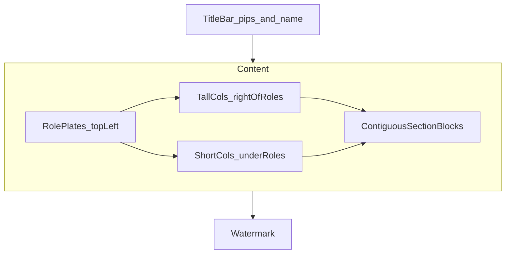
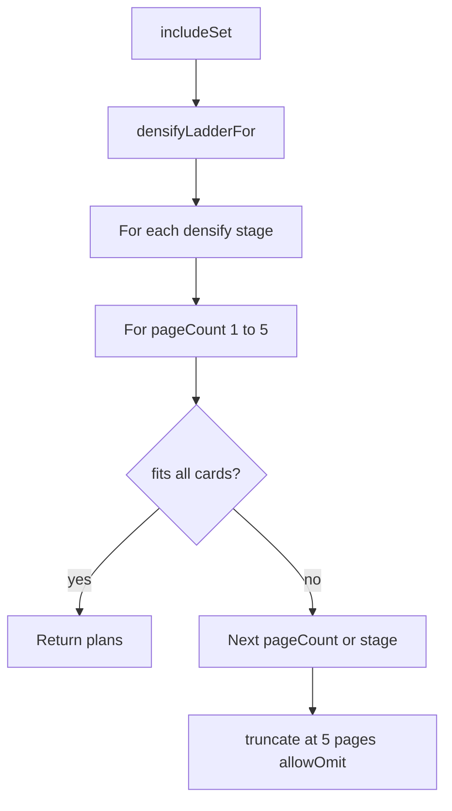

# Glance layout strategies

Reference for how Hub “at a glance” PNGs place cards. Layout lives in `@rayenz-hub/shared`; the API enriches art and composites with sharp. This doc covers **placement only** — see [`packages/api/README.md`](../packages/api/README.md) for art resolution and packaging.

| Product | Entry point | Planner |
|---------|-------------|---------|
| Deck glance | `buildGlanceLayoutPlan(includeSet, deckName)` | Single 1920×1080 page; densify at M, then shrink |
| Swap glance | `buildSwapGlanceLayoutPlans(includeSet)` | 1–5 pages at fixed M; densify ladder then truncate |

---

## Shared plate constants

Both products use the same canvas / M card size. Source of truth:
[`packages/shared/src/deck-builder/glance/plate.ts`](../packages/shared/src/deck-builder/glance/plate.ts)
(`glanceTitlePeek` / `glanceMaxStackedRows` for title-peek stacks).

| Constant | Value |
|----------|-------|
| Canvas | 1920×1080 |
| Default / Cube / swap background | `#b8d4e8` (sky-blue) |
| M card size | 213×297 (Scryfall 61∶85) |
| Title / header bar | 72px |
| Watermark / footer bar | 48px |

Product-specific packing gaps stay local (deck `COL_GAP` / margins vs swap).
Card conversion is shared via
[`card-from-instance.ts`](../packages/shared/src/deck-builder/glance/card-from-instance.ts).

**Commander deck-glance chrome** is themed from commander colour identity (`titlePips`) via `resolveGlanceChromeTheme`:

| Identity | Header / footer | Background |
|----------|-----------------|------------|
| Colourless | silver | silver wash |
| Mono | darker shade of that colour | lighter wash (solid) |
| Dual | 1st pip / 2nd pip | mid soft-blend split (left→right) |
| 3+ | gold | gold wash |
| Cube format | legacy translucent dark bars | sky-blue |

White maps to cream/tan (not pure white). Bar text ink flips for contrast. Section category headings use a centered frosted band (deck + swap); swap plate colours stay sky-blue.

**Generation versions** (`GLANCE_GENERATION_VERSION`, `SWAP_GLANCE_GENERATION_VERSION`) are part of cache keys and fingerprints. Bump them when layout, art tier, render pipeline, or delivery changes so stale PNGs are not served.

API handlers call the planners, then art enrichment + `glance-render` compositing.

---

## Deck glance

**Source:** [`packages/shared/src/deck-builder/glance/layout.ts`](../packages/shared/src/deck-builder/glance/layout.ts)

One packing strategy: fit the whole include-set on a single page using an L-shaped column masonry. Prefer denser column assignments at M before shrinking card height.

### Layout modes (`GlanceLayoutMode`)

| Mode | Remainder partitioning |
|------|------------------------|
| `type_line` (default) | Type-line **Main deck** + **Lands** (`nonLands` / `lands`) |
| `primary_category` | Groups by each card’s **primary** category; section order follows deck `categories` (custom), orphans alpha-sorted after |

Request body field `mode` (optional) on `POST …/decks/:id/glance`. Fingerprints include mode + ordered section names. UI radios in the glance dialog: **Main + Lands** / **Primary categories**.

### Inputs

From `GlanceIncludeSet`:

- **commanders** / **lieutenants** — highlight plates; capped at `GLANCE_ROLE_HIGHLIGHT_LIMIT` (2)
- **mode** / **sections** — ordered labeled stacks used for packing
- **nonLands** / **lands** — always filled for back-compat (type-line split); mirrored into `sections` when `mode === 'type_line'`
- **placeholders** — when the include-set is under 100 cards after swaps, synthetic `isPlaceholder` faces pad to 100; rendered as dashed “+” empty slots. Type-line mode pads **Main deck**. Primary-category mode fills included category `target` deficits first, then leftover faces go in a reserved **To be chosen** section (inserted before Land/Lands). When no category targets are set, all pad faces go to **To be chosen**.
- Deck name + **title pips** — WUBRG-ordered commander colour identity (`C` if colourless)

### Algorithm

1. **Card-size search (last resort)** — try `cardHeight` from `GLANCE_CARD_HEIGHT` (297) down to `MIN_CARD_HEIGHT` (48). At each size, try densify biases before stepping down. Width = `round(height × 61/85)`. First successful plan wins; all regions share that size.
2. **Role plates** — left column: commander plate, then lieutenant plate (label + rounded backdrop + side-by-side faces).
3. **L-shaped column grid** — short columns under the role plate use the left-origin grid (midpoint cutout so plate padding does not blank an extra column). Tall columns begin on a fresh grid at `roleBlockRight + COL_GAP` so the first deck column clears the plate. Under-role space is just shorter columns — not a separate mandatory allocation.
4. **Contiguous section blocks (vertical masonry)** — each column keeps a y-cursor. Place each section into a contiguous run of columns at that run’s current cursor (`max` of those cursors), then advance those cursors past the used stack. Later sections can pack into leftover vertical space under earlier ones (and under the role block). Prefer the highest free band; at that band, `max` bias takes more columns / `min` bias fewer.
5. **Land / Lands on the right** — packing order moves Land/Lands sections last. The packer reserves the minimum rightmost columns those lands need at the current card size so earlier categories cannot squeeze them into the middle; among equal-height candidates, Land prefers the rightmost run.
6. **Densify before shrink** — at a fixed card size: `max` bias then `min` bias. Only if both fail, shrink card height.
7. **Title-peek stacking** — peek per stacked card = `max(22, round(0.14 × cardHeight))`. `chunkByCapacity` balances cards across a section’s columns.
8. **Labels** — `Commander` / `Commanders`, `Lieutenant` / `Lieutenants`, plus each section name (`Main deck` / `Lands`, or primary category names).
9. **Failure** — if no size/bias fits, the plan has empty placements (no multi-page).

---

## Swap glance

**Source:** [`packages/shared/src/deck-builder/swap-glance/layout.ts`](../packages/shared/src/deck-builder/swap-glance/layout.ts)

Named strategies: pack modes plus a progressive **densify ladder**. Card size stays fixed at M (`GLANCE_CARD_WIDTH` / `GLANCE_CARD_HEIGHT`). Max pages: `SWAP_GLANCE_MAX_PAGES` (5).

### Categories

Each deck section’s rows split into:

| Category | Rows |
|----------|------|
| **Formal** | Out→In pairs and `queued_in` singles (“looking for”) |
| **Seeking** | `seeking` singles |

- **Multi-page:** formal pages first, then seeking (**category purity** — at most one category per page when possible).
- **Single page:** both categories may share page 1 in one masonry pass.

### Pack modes (`SwapGlancePackMode`)

| Mode | Behavior |
|------|----------|
| `grid` | Non-overlapping wrap. Pair units are Out + gap + In (`PAIR_INNER_GAP`); groups separated by `PAIR_GROUP_GAP`. |
| `stacked` | Title-peek columns for **singles only** (same peek formula as deck glance). Pair rows fall back to grid, then singles stack below. |

Formal pairs that are not converted always pack as **grid** (pairs cannot stack). After convert-to-looking-for, formal uses the densify stage’s looking-for mode.

### Densify ladder (`SwapGlanceDensifyStage`)

Planner order: for each applicable densify stage, try `pageCount` from 1…5; **first full fit wins**. Stages that change nothing for the include-set are skipped (`densifyLadderFor`).

| Stage | Seeking | Looking-for / formal singles | Pairs |
|-------|---------|------------------------------|-------|
| `base` | grid | grid | Keep Out→In (grid) |
| `seeking_stacked` | stacked | grid | Keep pairs (skipped if no seeking) |
| `looking_for_stacked` | stacked | stacked | Keep pairs (skipped when only pairs and no looking-for / not `in_only`) |
| `swaps_to_looking_for_grid` | stacked | grid | Convert: keep In as `queued_in` single, drop Out (skipped if no pairs) |
| `swaps_to_looking_for_stacked` | stacked | stacked | Same convert |
| `truncate` | Last densify settings + **allow omit** | same | same; overflow labels `+N more` / `+N cards` |

`omittedCardCount` and `densifyStage` are returned on the layout result; the API also exposes densify via body field / `x-glance-densify`. Fingerprints include densify stage and page index/count.

### Masonry

Per page region:

- Prefer the **maximum column count** that still fits the widest pair unit.
- Place each section into the **shortest** column.
- Reject layouts with non-stack face overlaps when omit is not allowed (pair overflow into a neighbor column).

### Planner flow

Public wrappers:

- `buildSwapGlanceLayoutPlans` — full multi-page result
- `buildSwapGlanceLayoutPlan` — first page only (prefer the plural API when multi-image output is needed)

---

## Code index

| Concern | Path |
|---------|------|
| Shared plate / peek | `packages/shared/src/deck-builder/glance/plate.ts` |
| Card from instance | `packages/shared/src/deck-builder/glance/card-from-instance.ts` |
| Fingerprint base identity | `packages/shared/src/deck-builder/glance/card-identity.ts` |
| Deck layout | `packages/shared/src/deck-builder/glance/layout.ts` |
| Deck types / version | `packages/shared/src/deck-builder/glance/types.ts` |
| Swap layout facade | `packages/shared/src/deck-builder/swap-glance/layout.ts` |
| Swap layout shared | `packages/shared/src/deck-builder/swap-glance/layout-shared.ts` |
| Swap densify ladder | `packages/shared/src/deck-builder/swap-glance/densify.ts` |
| Swap pack | `packages/shared/src/deck-builder/swap-glance/pack.ts` |
| Swap masonry | `packages/shared/src/deck-builder/swap-glance/masonry.ts` |
| Swap planner | `packages/shared/src/deck-builder/swap-glance/planner.ts` |
| Swap types / densify stages | `packages/shared/src/deck-builder/swap-glance/types.ts` |
| Deck API | `packages/api/src/handlers/deck-glance.ts` |
| Swaps API | `packages/api/src/handlers/swaps-glance.ts` |
| Cache / miss pipeline | `packages/api/src/handlers/glance-pipeline.ts` |
| Art enrichment | `packages/api/src/services/glance-art.ts` |
| PNG entry / re-exports | `packages/api/src/services/glance-render.ts` |
| PNG assets / faces / watermark | `packages/api/src/services/glance-render-{assets,faces,watermark,labels}.ts` |
| PNG deck / swap chrome | `packages/api/src/services/glance-render-{deck,swap}.ts` |
| Web HTTP / PNG / UI chrome | `packages/web/src/lib/glance-{http,png}.ts`, `glance-ui.tsx` |
| Deck glance client | `packages/web/src/deck-builder/store/deck-glance-api.ts` |
| Swaps glance client | `packages/web/src/swap-queue/swaps-glance-api.ts` |
| Deck layout tests | `tests/unit/hub/deck-builder-glance-layout.test.ts` |
| Swap layout tests | `tests/unit/hub/swap-glance.test.ts` |
| API glance render helpers | `tests/api/helpers/glance-render.ts` |
| API deck / swaps suites | `tests/api/deck-glance.test.ts`, `tests/api/swaps-glance.test.ts` |
| Web glance RTL | `tests/web/glance-generate.test.tsx`, `tests/web/swaps-glance-dialog.test.tsx` |
